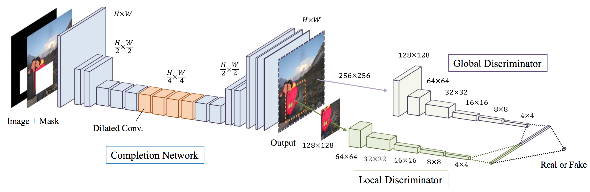
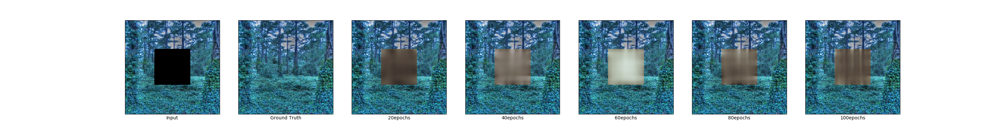

# Globally and Locally Consistent Image Completion (GLCIC)
画像の部分的な欠損を補完する手法である GLCIC を Keras で実装しています。   


論文の表2より抜粋[^1]  

# 環境
- Python 3
- TensorFlow 1.4 (TensorFlow-gpu)
- Keras 2.1
- OpenCV
- COCO API

## GCPのDatalabインスタンスの場合
当方ではGCPのDatalabインスタンスを利用し検証しました。
その際のパッケージインストールコマンドは以下の通りです。
参考まで。
```
apt-get update 
apt-get install -y --allow-unauthenticated graphviz 
apt-get install -y --allow-unauthenticated python-opencv 
apt-get install -y --allow-unauthenticated vim 
apt-get install -y --allow-unauthenticated python3 
apt-get install -y --allow-unauthenticated python3-pip 
apt-get install -y --allow-unauthenticated python3-tk 
pip3 install --upgrade pip 
pip3 install cython 
pip3 install numpy 
pip3 install tensorflow-gpu 
pip3 install scikit-image 
pip3 install scikit-learn 
pip3 install keras 
pip3 install h5py 
pip3 install pydot 
pip3 install pydot3 
pip3 install pydot-ng 
pip3 install graphviz 
pip3 install opencv-python 
```

# 学習に利用したデータセット
Places  
http://places2.csail.mit.edu/download.html  
```
mkdir /path/to/dataset
cd /path/to/dataset
wget http://data.csail.mit.edu/places/places365/test_256.tar
wget http://data.csail.mit.edu/places/places365/val_256.tar
unzip test_256.tar
unzip val_256.tar
# train_256.tarは21Gbyteと大きいためtest_256で代用した
mv test train
```

# 論文と異なる点、制約事項
- 学習効率優先のため、入力画像サイズを256*256に固定。
- generatorの出力が安定しない(ほぼノイズ...)ため、以下を調整。[^2]
  - generator, discriminatorともreluをleakyreluに変更。
  - generatorの出力層の活性化関数をsigmoidからtanhに変更。
- 論文中にある後処理(fast marching method, followed by Poisson image blending)は未実装。

# 使い方
## 学習
3ステージに分けて学習する。
- stage1  
generatorのみの学習。
```
python3 train.py --data_path /path/to/dataset --stage 1
```
- stage2  
discriminatorのみの学習。
```
python3 train.py --weights_path ./model/glcic-latest-stage1-xx.h5 --data_path /path/to/dataset --stage 2
```
- stage3  
RPN+Headの学習。
```
python3 train.py --weights_path ./model/glcic-latest-stage2-xx.h5 --data_path /path/to/dataset --stage 3
```
各ステージのイテレーションは少なめなので、実行環境や許容されるコストに合わせて調整してください。


## テスト
```
python3 predict.py --weights_path ./model/glcic-stage3-xx.h5 --input_path /path/to/testdata
```

### 結果
#### 学習回数
- stage1: 16サンプル * 100ステップ * 100epoch
- stage2: 16サンプル * 100ステップ * 100epoch
- stage3: 16サンプル * 100ステップ * 100epoch

論文では、K80GPU×4のマシン1台で約2ヶ月学習したとのこと。

> The entire training procedure takes roughly 2 months on a single machine equipped with four K80 GPUs.

上記はGCPのK80×1を1台で各合計30時間程度なので、到底及ばず。。。

#### stage3における20epoch毎の出力画像





#### 結果考察
- stage3最終版の出力画像では、もや〜っと正解データらしきものは得られているが、まだ錯覚のレベル。  
単に周辺画像を繰り返してモザイクかけたような出力と大差が無い。  
改善のためには、更なる学習とともに、各ステージでパラメータ（discriminatorの損失関数のalpha等)を調整する必要がありそう。  
論文に以下のような記述がある。
> In practice, we take a more fine-grained control, such as initially keeping the norm of the MSE loss gradient roughly the same order of magnitude as the norm of the discriminator gradient. This helps stabilize the learning.

- stage3の中盤からdiscriminatorの損失が0になってしまっていた。
このせいで、出力画像の精度が低下している可能性はありそう。

# TODO
- 学習時のパラメータ調整と更なる学習
- discriminatorの損失関数の見直し

# 参考資料
- http://hi.cs.waseda.ac.jp/~iizuka/projects/completion/ja/
- http://hi.cs.waseda.ac.jp/~iizuka/projects/completion/data/completion_sig2017.pdf
- https://github.com/tadax/glcic
- https://qiita.com/underfitting/items/a0cbb035568dea33b2d7

[^1]: http://hi.cs.waseda.ac.jp/~iizuka/projects/completion/data/completion_sig2017.pdf
[^2]: https://qiita.com/underfitting/items/a0cbb035568dea33b2d7
